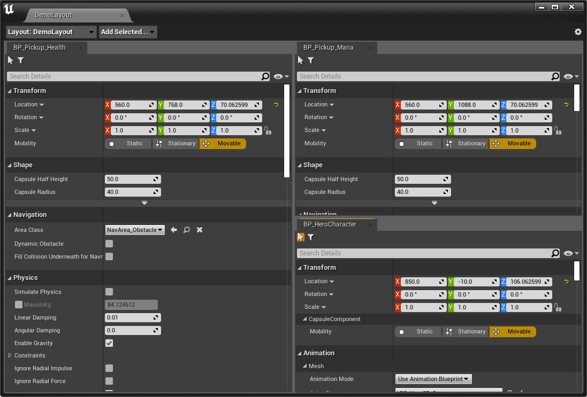

# Details Workspace (for UE4)
Details Workspace is a UE4 editor plugin for better artist/designer workflow.    
It allows you to create any number of "Details" tab of actor/component/assets, and arrange the tabs freely in a panel.  

Example:  
  
Setup:  

Filter by category:  

This could be useful, if you're doing some work that require many actor/components to work together, e.g. environment lighting.  

> UE4 actually has a built-in window named "Env. Light Mixer" for such purpose, but it only supports hard-coded objects, and doesn't allow changing the layout.  
 
Currently it's only tested on 4.27. But it's mostly plain slate code, so I suppose any UE version will work. (Compile other versions yourself)

## Features  
* Any actor/component/asset is supported.  
* Save/Load/Switch multiple layouts as you want. (In-level actor/components can be saved as well!).   
* Support category filtering. 
    * "Show-Only Category"(UE5 style) and "Hide Category" are supported.  
* PIE object auto switch.  
* Support Sequencer key frame button.  
    * Surprisingly UE4 doesn't automatically do this for you, if you create Details yourself.  

## How to Use  

1. Install the plugin.
    * If you're using 4.27, you can get binary version in release, and put it in your \[Project\]/Plugins folder.  
    * Otherwise, clone the source to your project Plugins folder. You should specify clone directory name to DetailsWorkspace, since it's plugin name, e.g.   
    `git clone https://github.com/yangrc1234/UE4-Details-Workspace.git DetailsWorkspace`

2. Open project. A new item should appear in Window menu:    

3. Open the window, you should see:  
  

4. Create tab for your object.
    * Drag any asset/actor onto the window to add it.
    * Select actor in World Outliner normally, a button will appear allowing you to add its component.  
    
5. Change the layout as you like.

## Note  
* Drag-n-drop is not supported for Component. You need to drag/select the actor, and add component from menu.
   * This is UE4 limitation, and might can't be "fixed".  
* Once you add an object to the layout, the level package might be marked dirty(Ask you to save before exit). You must save it, otherwise reference could be lost next time you open the level.     
    * This is because we use LazyObjectPtr to store the reference, which might edit the object in level to store a persistent GUID. 
* The layout info is saved under you developer folder("Devvelopers/\[YourUserName\]/DetailsWorkspaceLayoutProfile).  