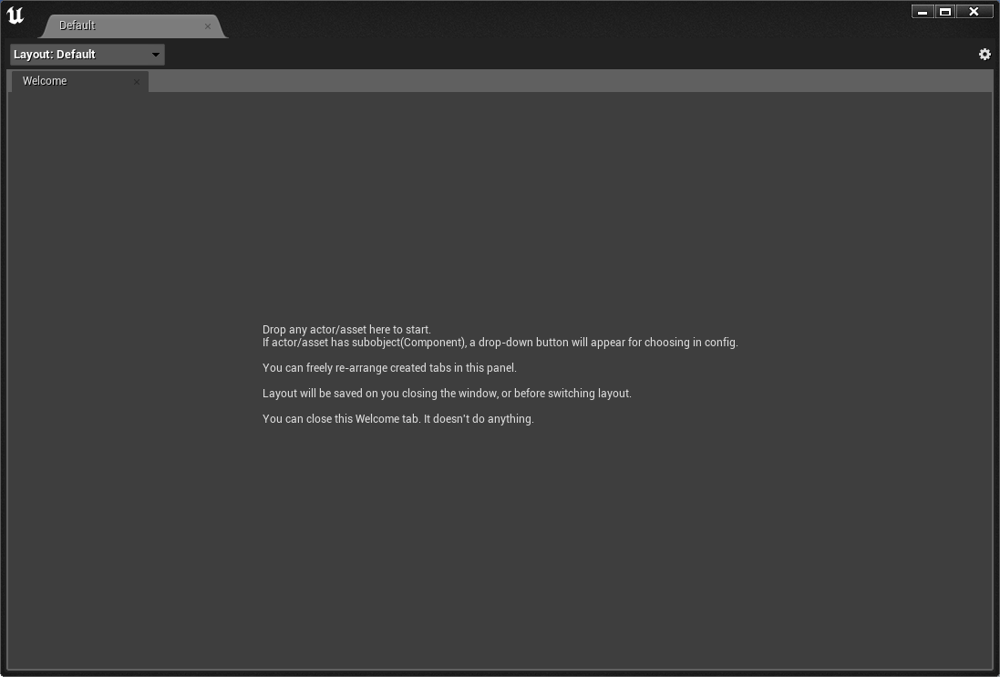

# Details Workspace (for UE4)
Details Workspace is a UE4 editor plugin for better artist/designer workflow.    
It allows you to create any number of "Details" tab of actor/component/assets, and arrange the tabs freely.  
Example:  
  
Setup:  

This could be useful, if you're doing some work that require many actor/components to work together, e.g. environment lighting.  

> UE4 actually has a built-in window named "Env. Light Mixer", but it only supports hard-coded objects, and doesn't allow changing the layout.  
 
Currently it's only tested on 4.27. But it's mostly plain slate code, so I suppose any UE version will work.

## Features  
* Any actor/component/asset is supported.  
* Layouts can be saved/loaded(Including in-level actor/components). 
* Support multiple layouts to switch from.

## How to Use  

1. Clone the source to your project Plugins folder. 
   * You should specify clone directory name to DetailsWorkspace, since it's plugin name, e.g.   
    `git clone https://github.com/yangrc1234/UE4-Details-Workspace.git DetailsWorkspace`

2. Open project. A new item should appear in Window menu:    

3. Open the window, you should see:  
  

4. Drag any asset/actor onto the window.
    * If it has no sub-object(Component), a Detail tab will be created.  
    * Otherwise, you will need to select what to add in the menu.   
    
5. Change the layout as you like.

## Limitations
* Drag-n-drop is not supported for Component. You need to drag the actor, and add component from menu.
   * This is UE4 limitation, and might can't be "fixed".  
